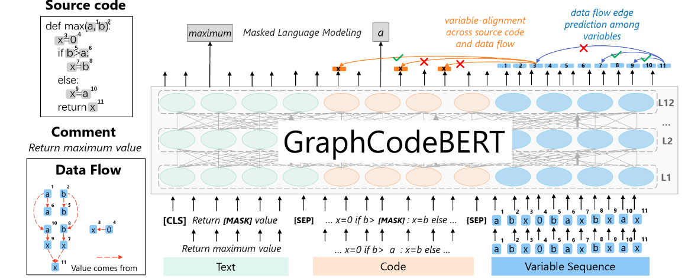
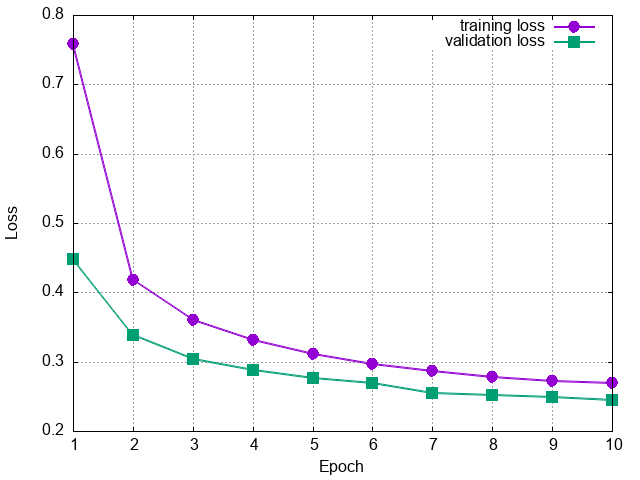
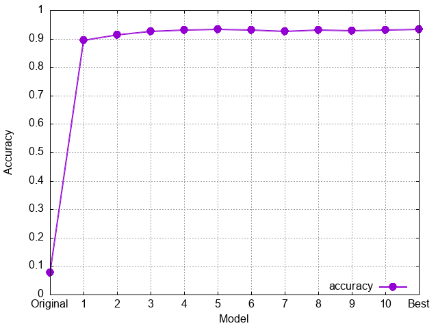
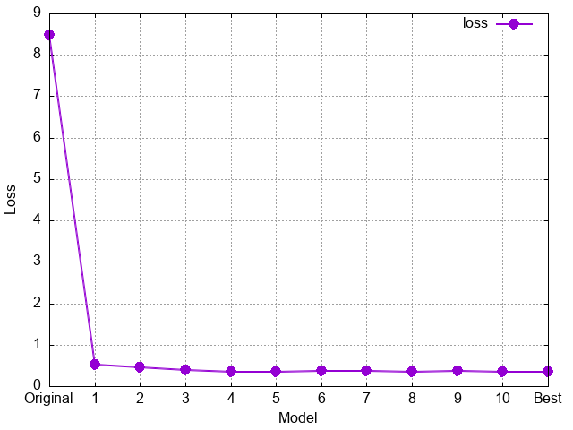
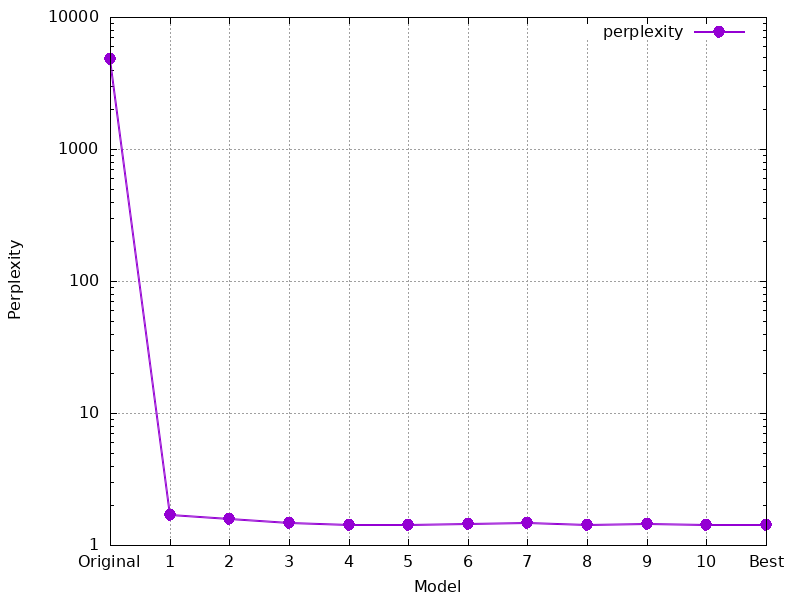
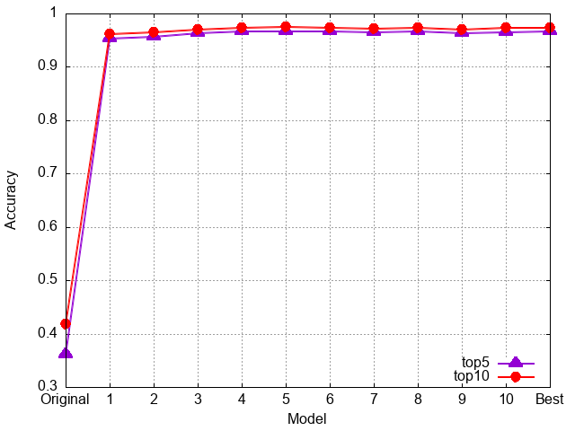

#+TITLE: ErlangBERT: A pre-trained transformer model for Erlang code understanding and embedding
#+AUTHOR: Gábor Rétvári, Tamás Lévai
#+DATE: 2025-07-29

#+INCLUDE: "./template.org"

#+OPTIONS: H:2 toc:nil num:nil timestamp:nil date:t
# #+LATEX_CLASS: beamer
# #+LATEX_CLASS_OPTIONS: [presentation]
# #+BEAMER_THEME: Berlin
# #+LATEX_HEADER: \setbeamertemplate{footline}{}
# #+LATEX_HEADER: \setbeamertemplate{navigation symbols}{}
#+LATEX_HEADER: \definecolor{myblue}{HTML}{1F4E79}
#+LATEX_HEADER: \hypersetup{colorlinks=true,urlcolor=myblue,linkcolor=myblue}

** Motivation

*AI-assisted code comprehension*: downstream tasks, like code search, code completion, or automated code documentation, require a tool for inferring deep semantic meaning of code tokens, functions, and entire programs

*Bidirectional encoder representations from transformer (BERT)*: general encoder architecture based on multi-head self-attention to capture contextual representations

*Pre-trained via Masked Language Modeling*: base model trained on large corpora with random tokens masked to let the model learn to predict the missing tokens using context

*Motivation:*
- Erlang lacks a large open-source language corpus and it represents < 1% of typical training corpora
- Erlang has unique language features (functional programming, pattern matching, and message passing) that require domain-specific models
- General models (CodeBERT, GraphCodeBERT) trained on mainstream languages

*Goal:* An Erlang-specific BERT base model trained with MLM

** Objectives
*Goal*: create a specialized embedding model for Erlang language by fine-tuning GraphCodeBERT

Contributions:
- Reproducible open-source corpus creation methodology
- Pre-trained BERT model specialized for Erlang (full retraining or LoRA)
- Comprehensive evaluation on Erlang-specific tasks
- Open-source tools and datasets for the community

** Prior work

*Datasets:*
- [[https://huggingface.co/datasets/supergoose/buzz_sources_177_erlang][~supergoose/buzz_sources_177_erlang~: Erlang refactoring samples for contrastive learning]]

  No documentation, no model card, but the dataset itself is pretty interesting
- [[https://github.com/harp-project/deep-learning-based-erlang-refactoring][~szalontaib/erlang-refactoring~: Dataset used for refactoring nonidiomatic Erlang code]]

  Paper available: Balázs Szalontai, Péter Bereczky and Dániel Horpácsi, [[https://doi.org/10.36244/ICJ.2023.5.1][Deep Learning-Based Refactoring with Formally Verified Training Data]], Infocommunications Journal, Special Issue on Applied Informatics, 2023, pp. 2-8,

  Created at the Department of Programming Languages, ELTE

Can't seem to find any models at HuggingFace

** Methodology

We decided to train a new BERT model for Erlang code comprehension by fine-tuning GraphCodeBERT: *ErlangBERT*

*Tasks:*
1. Create a corpus
1. Parse and extract DFG
1. Build a dataset
1. Fine-tune the model: full retraining plus LoRA
1. Evaluate

\bigskip

Implementation available on GitHub: [[https://github.com/hsnlab/erlangbert][hsnlab/erlangbert]]
- Python + tree-sitter + Py-Torch

** GraphCodeBERT

A pre-trained multimodal BERT model for code understanding:
- Extension of CodeBERT with data flow graph integration
- Pre-trained on code-text pairs and graph-based code structure
- Achieves state-of-the-art results on code-related downstream tasks
- Does not quite work for legacy programming languages, like C++ or Erlang

#+ATTR_LATEX: :width .825\textwidth

** Phase 1: Corpus creation

GitHub scraping:
- Discover OSS Erlang repositories
  - updated in the last 5 years
  - has at least 5 stars
  - has a repo size b/w 100kB and 100MB
- Keep the top-1k, use scoring:
  | aspect       | max score |
  |--------------+-----------|
  | stars        |        40 |
  | erlang usage |        30 |
  | activity     |        20 |
  | size         |        10 |
- Clone repos locally

*Output: 346 repos (1.4GB)*

** Phase 2: Parsing

Extract Erlang functions:
- Search ~.erl~ and ~.hrl~ files in the cloned repos
- Collect Erlang functions
  - scoring (maxed to ~100~):
    | aspect                                     | max score |
    |--------------------------------------------+-----------|
    | base (has code)                            |        10 |
    | docstring                                  |        25 |
    | function length (goal: keep 100-500 chars) |        20 |
    | #clauses                                   |        25 |
    | #variables                                 |        20 |
    | complexity (e.g., guards, error handling)  |        50 |

- Combine clauses to a single function representation
- Tokenize with [[https://github.com/WhatsApp/tree-sitter-erlang][WhatsApp's tree-sitter-erlang]]

*Output: 339 897 functions (min score: 5)*

** Phase 3: Dataset building

Build a GraphCodeBERT model:
- Create a GraphCodeBERT-compatible dataset
- Retokenize with RoBERTa
- Convert to GraphCodeBERT format: \\
  ~[cls]+docstring+[sep]+code+[sep]+variables~

\vfill

*Output: #funcs: train: 271 917, test: 33 991, validate: 33 989*

** Phase 4: Model fine-tuning
GraphCodeBERT model for Erlang code MLM training that implements the
full GraphCodeBERT architecture as described in the paper:
- RoBERTa base for token representations
- Graph-guided masked attention for incorporating data flow
- MLM head for masked language modeling

MLM head:
- full-training (LoRA implemented but not tested yet)
- training params:
  #+ATTR_LATEX: :options fontsize=\tiny
  #+begin_src python :exports code
  'batch_size': 8, 'learning_rate': 2e-5, 'num_epochs': 10, 'warmup_steps': 1000,'weight_decay': 0.01, 'adam_epsilon': 1e-8, 'max_grad_norm': 1.0
  #+end_src

Training takes roughly 20hrs on a Quadro RTX 5000 16GB

*Output: models: init, epoch 1-10, best (475MB each)*

** Phase 5: Evaluation

Model evaluation for the MLM task:
1. Training results
1. Cross validation
1. Code token prediction demo on ~max(A,B)~

* Results

** Training: loss over 10 epochs

#+ATTR_LATEX: :width .7\textwidth

*** loss calc :noexport:
#+TBLNAME: loss-data
| epoch | training loss | validation loss |
|-------+---------------+-----------------|
|     1 |        0.7586 |          0.4486 |
|     2 |        0.4177 |          0.3380 |
|     3 |        0.3604 |          0.3033 |
|     4 |        0.3317 |          0.2884 |
|     5 |        0.3117 |          0.2769 |
|     6 |        0.2963 |          0.2698 |
|     7 |        0.2869 |          0.2549 |
|     8 |        0.2776 |          0.2525 |
|     9 |        0.2718 |          0.2493 |
|    10 |        0.2687 |          0.2447 |
#+BEGIN_SRC gnuplot :var data=loss-data :file figs/training_loss_plot.png :exports results
  reset
  set size 1,1
  #set title "Training Loss Over Epochs"
  set xlabel "Epoch"
  set ylabel "Loss"
  set grid
  plot data using 1:2 with linespoints linewidth 2 pointtype 7 pointsize 1.5 title "training loss", \
       data using 1:3 with linespoints linewidth 2 pointtype 5 pointsize 1.5 title "validation loss"
#+END_SRC

** Cross-validation 1/2: overview

Model Cross-validation on an external repo, the  ~elixir-lang/elixir~
- main repo of the Elixir language
- 25.5k stars, 3.4k forks, latest release: 2025-05-21

\bigskip

*** a :BMCOL:
 :PROPERTIES:
 :BEAMER_opt: [t]
 :BEAMER_col: 0.55
 :END:

Evaluation params:
- 1175 functions
- 17 990 masked tokens
- MLM probability: 0.15
- max sequence length: 256

*** b :BMCOL:
 :PROPERTIES:
 :BEAMER_opt: [t]
 :BEAMER_col: 0.55
 :END:

Metrics:
- MLM accuracy
- Loss
- Perplexity
- Top 5 accuracy
- Top 10 accuracy

*** results calc                                                   :noexport:
#+TBLNAME: crosseval-data
|    model | mlm_mlm_accuracy | mlm_mlm_loss | mlm_perplexity | mlm_top5_accuracy | mlm_top10_accuracy |
|----------+------------------+--------------+----------------+-------------------+--------------------|
| Original |           0.0774 |       8.4810 |      4822.1483 |            0.3599 |             0.4180 |
|        1 |           0.8937 |       0.5195 |         1.6812 |            0.9534 |             0.9618 |
|        2 |           0.9130 |       0.4599 |         1.5840 |            0.9559 |             0.9640 |
|        3 |           0.9244 |       0.3856 |         1.4704 |            0.9632 |             0.9702 |
|        4 |           0.9298 |       0.3522 |         1.4222 |            0.9661 |             0.9734 |
|        5 |           0.9324 |       0.3421 |         1.4078 |            0.9667 |             0.9742 |
|        6 |           0.9312 |       0.3602 |         1.4337 |            0.9656 |             0.9732 |
|        7 |           0.9261 |       0.3756 |         1.4559 |            0.9646 |             0.9707 |
|        8 |           0.9292 |       0.3549 |         1.4260 |            0.9665 |             0.9728 |
|        9 |           0.9285 |       0.3661 |         1.4421 |            0.9635 |             0.9705 |
|       10 |           0.9310 |       0.3501 |         1.4192 |            0.9654 |             0.9731 |
|     Best |           0.9336 |       0.3426 |         1.4086 |            0.9657 |             0.9738 |
#+BEGIN_SRC gnuplot :var data=crosseval-data :file figs/crosseval_mlm_accuracy.png :exports results
  reset
  set size 1,1
  set key right bottom
  #set title ""
  set xlabel "Model"
  set ylabel "Accuracy"
  set grid
  plot data using 2:xticlabels(1) with linespoints linewidth 2 pointtype 7 pointsize 1.5 title "accuracy"
#+END_SRC
#+BEGIN_SRC gnuplot :var data=crosseval-data :file figs/crosseval_mlm_loss.png :exports results
  reset
  set size 1,1
  #set title ""
  set xlabel "Model"
  set ylabel "Loss"
  set grid
  plot data using 3:xticlabels(1) with linespoints linewidth 2 pointtype 7 pointsize 1.5 title "loss"
#+END_SRC
#+BEGIN_SRC gnuplot :var data=crosseval-data :file figs/crosseval_mlm_perplexity.png :exports results
  reset
  set size 1,1
  #set title ""
  set xlabel "Model"
  set ylabel "Perplexity"
  set grid
  set logscale y
  plot data using 4:xticlabels(1) with linespoints linewidth 2 pointtype 7 pointsize 1.5 title "perplexity"
#+END_SRC
#+BEGIN_SRC gnuplot :var data=crosseval-data :file figs/crosseval_mlm_topaccuracy.png :exports results
  reset
  set size 1,1
  set key right bottom
  #set title ""
  set xlabel "Model"
  set ylabel "Accuracy"
  set grid
  plot data using 5:xticlabels(1) with linespoints linewidth 2 pointtype 9 pointsize 1.5 title "top5", \
       data using 6:xticlabels(1) with linespoints linewidth 2 pointtype 7 pointsize 1.5 lc "red" title "top10"
#+END_SRC

** Cross-validation Results: Accuracy

#+ATTR_LATEX: :width .7\textwidth

** Cross-validation Results: Loss

#+ATTR_LATEX: :width .7\textwidth

** Cross-validation Results: Perplexity

#+ATTR_LATEX: :width .7\textwidth

** Cross-validation Results: Top 5 and Top 10 accuracies

#+ATTR_LATEX: :width .7\textwidth

** Code token prediction demo

Input:
#+begin_src python :exports code
max_function = {
    "idx": "test::max/2::0",
    "code": "max(A, B) when A > B -> A; max(A, B) -> B.",
    "code_tokens": ["[CLS]", "max", "(", "A", ",", "B", ")", "when", "A", ">", "B", "->", "A", ";", "max", "(", "A", ",", "B", ")", "->", "B", ".", "[SEP]"],
    "variable_positions": [(3, "A", True), (5, "B", True), (8, "A", False), (10, "B", False), (12, "A", False), (16, "A", True), (18, "B", True), (21, "B", False)],
    "dataflow_graph": [("A", 3, "comesFrom", [], []), ("B", 5, "comesFrom", [], []), ("A", 8, "comesFrom", ["A"], [3]), ("B", 10, "comesFrom", ["B"], [5]), ("A", 12, "comesFrom", ["A"], [8]), ("A", 16, "comesFrom", [], []), ("B", 18, "comesFrom", [], []), ("B", 21, "comesFrom", ["B"], [18])],
    "docstring_tokens": ["Returns", "the", "maximum", "of", "two", "numbers"]
}
#+end_src

To reproduce the demo:
#+begin_src shell :exports code
cd erlang_corpus_scraper/benchmark
python mlm.py <model_checkpoint_path>
#+end_src

** Code token prediction demo 1

*** a :BMCOL:
 :PROPERTIES:
 :BEAMER_opt: [t]
 :BEAMER_col: 0.525
 :END:

Original model

#+ATTR_LATEX: :options fontsize=\tiny
#+begin_src fundamental
Position 9: Original RoBERTa token 'max'
  Top-5 predictions:
    1. <mask>       0.2481
    2. rowd         0.0024
    3. undred       0.0012
    4. ++++         0.0010
    5. aeper        0.0009
  Original token not in top-5 (prob: 0.000507)

Position 10: Original RoBERTa token '('
  Top-5 predictions:
    1. <mask>       0.1668
    2. ĠCollege     0.0016
    3. ans          0.0015
    4. Ġfootage     0.0015
    5. Ġ(           0.0012
  Original token not in top-5 (prob: 0.000979)
#+end_src

*** b :BMCOL:
 :PROPERTIES:
 :BEAMER_opt: [t]
 :BEAMER_col: 0.525
 :END:

Our model

#+ATTR_LATEX: :options fontsize=\tiny
#+begin_src fundamental
Position 9: Original RoBERTa token 'max'
  Top-5 predictions:
    1. max          0.9980 <-
    2. Max          0.0006
    3. min          0.0006
    4. Ġmax         0.0005
    5. MAX          0.0001
  Original token ranked #1

Position 10: Original RoBERTa token '('
  Top-5 predictions:
    1. (            1.0000 <-
    2. ((           0.0000
    3. Ġ(           0.0000
    4. ($           0.0000
    5. (-           0.0000
  Original token ranked #1
#+end_src

** Code token prediction demo 2

*** a :BMCOL:
 :PROPERTIES:
 :BEAMER_opt: [t]
 :BEAMER_col: 0.525
 :END:

Original model

#+ATTR_LATEX: :options fontsize=\tiny
#+begin_src fundamental
Position 11: Original RoBERTa token 'A'
  Top-5 predictions:
    1. <mask>       0.6006
    2. A            0.0024 <-
    3. 121          0.0019
    4. ĠA           0.0017
    5. Action       0.0017
  Original token ranked #2

Position 12: Original RoBERTa token ','
  Top-5 predictions:
    1. <mask>       0.3763
    2. ans          0.0034
    3. MB           0.0012
    4. <            0.0011
    5. Ġ)           0.0011
  Original token not in top-5 (prob: 0.000098)
#+end_src

*** b :BMCOL:
 :PROPERTIES:
 :BEAMER_opt: [t]
 :BEAMER_col: 0.525
 :END:

Our model

#+ATTR_LATEX: :options fontsize=\tiny
#+begin_src fundamental
Position 11: Original RoBERTa token 'A'
  Top-5 predictions:
    1. A            0.9999 <-
    2. B            0.0000
    3. a            0.0000
    4. ĠA           0.0000
    5. C            0.0000
  Original token ranked #1

Position 12: Original RoBERTa token ','
  Top-5 predictions:
    1. ,            1.0000 <-
    2. and          0.0000
    3. ++           0.0000
    4. _            0.0000
    5. +            0.0000
  Original token ranked #1
#+end_src

** Code token prediction demo 3

*** a :BMCOL:
 :PROPERTIES:
 :BEAMER_opt: [t]
 :BEAMER_col: 0.525
 :END:

Original model

#+ATTR_LATEX: :options fontsize=\tiny
#+begin_src fundamental
Position 13: Original RoBERTa token 'B'
  Top-5 predictions:
    1. <mask>       0.5840
    2. B            0.0154 <-
    3. ĠB           0.0051
    4. b            0.0049
    5. 2            0.0018
  Original token ranked #2

Position 14: Original RoBERTa token ')'
  Top-5 predictions:
    1. <mask>       0.5653
    2. ans          0.0012
    3. ĠDianne      0.0008
    4. Ġreconciliation 0.0008
    5. ian          0.0008
  Original token not in top-5 (prob: 0.000317)
#+end_src

*** b :BMCOL:
 :PROPERTIES:
 :BEAMER_opt: [t]
 :BEAMER_col: 0.525
 :END:

Our model

#+ATTR_LATEX: :options fontsize=\tiny
#+begin_src fundamental
Position 13: Original RoBERTa token 'B'
  Top-5 predictions:
    1. B            0.9998 <-
    2. A            0.0000
    3. BE           0.0000
    4. b            0.0000
    5. ĠB           0.0000
  Original token ranked #1

Position 14: Original RoBERTa token ')'
  Top-5 predictions:
    1. )            1.0000 <-
    2. Ġ)           0.0000
    3. )"           0.0000
    4. _            0.0000
    5. );           0.0000
  Original token ranked #1
#+end_src

** Code token prediction demo 4

*** a :BMCOL:
 :PROPERTIES:
 :BEAMER_opt: [t]
 :BEAMER_col: 0.525
 :END:

Original model

#+ATTR_LATEX: :options fontsize=\tiny
#+begin_src fundamental
Position 15: Original RoBERTa token 'when'
  Top-5 predictions:
    1. <mask>       0.0959
    2. ĠBoom        0.0038
    3. ĠManor       0.0026
    4. Ġshots       0.0020
    5. ĠCollege     0.0016
  Original token not in top-5 (prob: 0.000034)

Position 16: Original RoBERTa token 'A'
  Top-5 predictions:
    1. <mask>       0.9520
    2. <s>          0.0016
    3. Two          0.0003
    4. A            0.0002 <-
    5. --------     0.0002
  Original token ranked #4
#+end_src

*** b :BMCOL:
 :PROPERTIES:
 :BEAMER_opt: [t]
 :BEAMER_col: 0.525
 :END:

Our model

#+ATTR_LATEX: :options fontsize=\tiny
#+begin_src fundamental
Position 15: Original RoBERTa token 'when'
  Top-5 predictions:
    1. when         0.9999 <-
    2. if           0.0001
    3. When         0.0000
    4. Ġwhen        0.0000
    5. Ġif          0.0000
  Original token ranked #1

Position 16: Original RoBERTa token 'A'
  Top-5 predictions:
    1. A            0.9999 <-
    2. a            0.0000
    3. ĠA           0.0000
    4. CA           0.0000
    5. B            0.0000
  Original token ranked #1
#+end_src

** Code token prediction demo 5

*** a :BMCOL:
 :PROPERTIES:
 :BEAMER_opt: [t]
 :BEAMER_col: 0.525
 :END:

Original model

#+ATTR_LATEX: :options fontsize=\tiny
#+begin_src fundamental
Position 17: Original RoBERTa token '>'
  Top-5 predictions:
    1. <mask>       0.3360
    2. ĠBoom        0.0012
    3. Ġfacade      0.0011
    4. lap          0.0011
    5. <s>          0.0008
  Original token not in top-5 (prob: 0.000150)

Position 18: Original RoBERTa token 'B'
  Top-5 predictions:
    1. <mask>       0.5985
    2. Two          0.0022
    3. Ġconstraints 0.0021
    4. B            0.0019 <-
    5. ĠBoom        0.0013
  Original token ranked #4
#+end_src

*** b :BMCOL:
 :PROPERTIES:
 :BEAMER_opt: [t]
 :BEAMER_col: 0.525
 :END:

Our model

#+ATTR_LATEX: :options fontsize=\tiny
#+begin_src fundamental
Position 17: Original RoBERTa token '>'
  Top-5 predictions:
    1. >            0.6854 <-
    2. <            0.3125
    3. ==           0.0017
    4. Ġ>           0.0001
    5. Ġ<           0.0001
  Original token ranked #1

Position 18: Original RoBERTa token 'B'
  Top-5 predictions:
    1. B            0.9998 <-
    2. BE           0.0000
    3. CB           0.0000
    4. A            0.0000
    5. ĠB           0.0000
  Original token ranked #1
#+end_src

** Code token prediction demo 6

*** a :BMCOL:
 :PROPERTIES:
 :BEAMER_opt: [t]
 :BEAMER_col: 0.525
 :END:

Original model

#+ATTR_LATEX: :options fontsize=\tiny
#+begin_src fundamental
Position 19: Original RoBERTa token '->'
  Top-5 predictions:
    1. <mask>       0.1419
    2. Ġworst       0.0021
    3. ĠJackson     0.0013
    4. Ġcomplexes   0.0012
    5. <s>          0.0011
  Original token not in top-5 (prob: 0.000030)

Position 20: Original RoBERTa token 'A'
  Top-5 predictions:
    1. <mask>       0.7683
    2. Two          0.0009
    3. gans         0.0007
    4. Ġconstraints 0.0006
    5. <s>          0.0004
  Original token not in top-5 (prob: 0.000145)
#+end_src

*** b :BMCOL:
 :PROPERTIES:
 :BEAMER_opt: [t]
 :BEAMER_col: 0.525
 :END:

Our model

#+ATTR_LATEX: :options fontsize=\tiny
#+begin_src fundamental
Position 19: Original RoBERTa token '->'
  Top-5 predictions:
    1. ->           1.0000 <-
    2. ,            0.0000
    3. -            0.0000
    4. +            0.0000
    5. >            0.0000
  Original token ranked #1

Position 20: Original RoBERTa token 'A'
  Top-5 predictions:
    1. A            0.9989 <-
    2. B            0.0009
    3. a            0.0000
    4. C            0.0000
    5. ĠA           0.0000
  Original token ranked #1
#+end_src

** Code token prediction demo 7

*** a :BMCOL:
 :PROPERTIES:
 :BEAMER_opt: [t]
 :BEAMER_col: 0.525
 :END:

Original model

#+ATTR_LATEX: :options fontsize=\tiny
#+begin_src fundamental
Position 21: Original RoBERTa token ';'
  Top-5 predictions:
    1. <mask>       0.2940
    2. YN           0.0029
    3. Ġremorse     0.0017
    4. CAN          0.0013
    5. CN           0.0013
  Original token not in top-5 (prob: 0.000003)

Position 22: Original RoBERTa token 'max'
  Top-5 predictions:
    1. <mask>       0.7512
    2. Ġcrossover   0.0009
    3. Ġworst       0.0007
    4. Ġcollaboration 0.0006
    5. Ġresident    0.0005
  Original token not in top-5 (prob: 0.000107)
#+end_src

*** b :BMCOL:
 :PROPERTIES:
 :BEAMER_opt: [t]
 :BEAMER_col: 0.525
 :END:

Our model

#+ATTR_LATEX: :options fontsize=\tiny
#+begin_src fundamental
Position 21: Original RoBERTa token ';'
  Top-5 predictions:
    1. ;            0.9999 <-
    2. .            0.0000
    3. ';           0.0000
    4. -            0.0000
    5. +            0.0000
  Original token ranked #1

Position 22: Original RoBERTa token 'max'
  Top-5 predictions:
    1. max          0.9984 <-
    2. Max          0.0010
    3. Ġmax         0.0003
    4. min          0.0002
    5. MAX          0.0001
  Original token ranked #1
#+end_src

** Code token prediction demo 8

*** a :BMCOL:
 :PROPERTIES:
 :BEAMER_opt: [t]
 :BEAMER_col: 0.525
 :END:

Original model

#+ATTR_LATEX: :options fontsize=\tiny
#+begin_src fundamental
Position 23: Original RoBERTa token '('
  Top-5 predictions:
    1. <mask>       0.0264
    2. Ġ(           0.0042
    3. (            0.0036 <-
    4. _(           0.0028
    5. =(           0.0022
  Original token ranked #3

Position 24: Original RoBERTa token 'A'
  Top-5 predictions:
    1. <mask>       0.8907
    2. Ġ)           0.0011
    3. <s>          0.0006
    4. Ġ.           0.0005
    5. A            0.0004 <-
  Original token ranked #5
#+end_src

*** b :BMCOL:
 :PROPERTIES:
 :BEAMER_opt: [t]
 :BEAMER_col: 0.525
 :END:

Our model

#+ATTR_LATEX: :options fontsize=\tiny
#+begin_src fundamental
Position 23: Original RoBERTa token '('
  Top-5 predictions:
    1. (            1.0000 <-
    2. ((           0.0000
    3. ($           0.0000
    4. (-           0.0000
    5. _            0.0000
  Original token ranked #1

Position 24: Original RoBERTa token 'A'
  Top-5 predictions:
    1. _            0.9815
    2. A            0.0070 <-
    3. B            0.0027
    4. 0            0.0018
    5. false        0.0011
  Original token ranked #2
#+end_src

** Code token prediction demo 9

*** a :BMCOL:
 :PROPERTIES:
 :BEAMER_opt: [t]
 :BEAMER_col: 0.525
 :END:

Original model

#+ATTR_LATEX: :options fontsize=\tiny
#+begin_src fundamental
Position 25: Original RoBERTa token ','
  Top-5 predictions:
    1. <mask>       0.2283
    2. Ġ>           0.0031
    3. <            0.0029
    4. -->          0.0022
    5. >            0.0018
  Original token not in top-5 (prob: 0.000131)

Position 26: Original RoBERTa token 'B'
  Top-5 predictions:
    1. <mask>       0.8986
    2. B            0.0037 <-
    3. ĠB           0.0012
    4. Ġ)           0.0009
    5. Ġ.           0.0008
  Original token ranked #2
#+end_src

*** b :BMCOL:
 :PROPERTIES:
 :BEAMER_opt: [t]
 :BEAMER_col: 0.525
 :END:

Our model

#+ATTR_LATEX: :options fontsize=\tiny
#+begin_src fundamental
Position 25: Original RoBERTa token ','
  Top-5 predictions:
    1. ,            1.0000 <-
    2. _            0.0000
    3. =            0.0000
    4. +            0.0000
    5. bor          0.0000
  Original token ranked #1

Position 26: Original RoBERTa token 'B'
  Top-5 predictions:
    1. B            0.9645 <-
    2. _            0.0298
    3. A            0.0028
    4. b            0.0003
    5. C            0.0001
  Original token ranked #1
#+end_src

** Code token prediction demo 10

*** a :BMCOL:
 :PROPERTIES:
 :BEAMER_opt: [t]
 :BEAMER_col: 0.525
 :END:

Original model

#+ATTR_LATEX: :options fontsize=\tiny
#+begin_src fundamental
Position 27: Original RoBERTa token ')'
  Top-5 predictions:
    1. <mask>       0.7914
    2. Ġ)           0.0015
    3. )            0.0009 <-
    4. ra           0.0004
    5. '            0.0004
  Original token ranked #3

Position 28: Original RoBERTa token '->'
  Top-5 predictions:
    1. <mask>       0.1178
    2. when         0.0058
    3. Ġpose        0.0022
    4. Ġwhen        0.0022
    5. ĠMeadow      0.0017
  Original token not in top-5 (prob: 0.000017)
#+end_src

*** b :BMCOL:
 :PROPERTIES:
 :BEAMER_opt: [t]
 :BEAMER_col: 0.525
 :END:

Our model

#+ATTR_LATEX: :options fontsize=\tiny
#+begin_src fundamental
Position 27: Original RoBERTa token ')'
  Top-5 predictions:
    1. )            1.0000 <-
    2. Ġ)           0.0000
    3. )"           0.0000
    4. ]            0.0000
    5. }            0.0000
  Original token ranked #1

Position 28: Original RoBERTa token '->'
  Top-5 predictions:
    1. ->           1.0000 <-
    2. Ġ->          0.0000
    3. -            0.0000
    4. =>           0.0000
    5. ,            0.0000
  Original token ranked #1
#+end_src

** Code token prediction demo 11

*** a :BMCOL:
 :PROPERTIES:
 :BEAMER_opt: [t]
 :BEAMER_col: 0.525
 :END:

Original model

#+ATTR_LATEX: :options fontsize=\tiny
#+begin_src fundamental
Position 29: Original RoBERTa token 'B'
  Top-5 predictions:
    1. <mask>       0.5056
    2. <s>          0.0012
    3. gans         0.0010
    4. Ġconstraints 0.0010
    5. A            0.0009
  Original token not in top-5 (prob: 0.000409)

Position 30: Original RoBERTa token '.'
  Top-5 predictions:
    1. roid         0.0512
    2. YR           0.0080
    3. DOC          0.0045
    4. ĠSacrament   0.0043
    5. ient         0.0042
  Original token not in top-5 (prob: 0.000001)
#+end_src

*** b :BMCOL:
 :PROPERTIES:
 :BEAMER_opt: [t]
 :BEAMER_col: 0.525
 :END:

Our model

#+ATTR_LATEX: :options fontsize=\tiny
#+begin_src fundamental
Position 29: Original RoBERTa token 'B'
  Top-5 predictions:
    1. B            0.9894 <-
    2. A            0.0095
    3. C            0.0001
    4. BB           0.0001
    5. F            0.0001
  Original token ranked #1

Position 30: Original RoBERTa token '.'
  Top-5 predictions:
    1. IV           0.1236
    2. Y            0.0873
    3. ED           0.0786
    4. OD           0.0266
    5. IC           0.0235
  Original token not in top-5 (prob: 0.000000)
#+end_src

* Conclusion
** Summary
A working prototype
- **ErlangBERT**: First specialized BERT model for Erlang programming language
- **Methodology**: Systematic approach using GraphCodeBERT foundation
- **Corpus**: Reproducible corpus creation and evaluation framework
- **Open model**: Full pipeline for Erlang code analysis and tooling, available on GitHub: [[https://github.com/hsnlab/erlangbert][hsnlab/erlangbert]]

** Future Work
- Evaluate for E/// proprietary code
- Add *edge prediction* and *node alignment*: currently the variable dataflow graph is part of the dataset but it is not part of the masked language modeling framework
- Test LoRA adaptation: implemented but only full re-training is evaluated
- Implement. evaluate on downstream tasks: code search, code-duplication detection, drive a RAG workflow
- Fine-tune hyperparameters

* COMMENT Meeting notes

** 2025-07-25
- full: separate dir w/ training: add new param: root dir or workflow_id
- do not block on existing cloned_repos.jsonl
- cross-validator: full dataset instead of test.json; add validation.json + train.json
- we skip the closing '.' somehow?!
- student: fix DFG attention (graph edges)
- student: fine-tuning for code search

** raw results

elixir

Dataset initialized with 1175 examples
Max sequence length: 256
MLM probability: 0.15

mlm_total_examples: 1175.0000
mlm_total_masked_tokens: 17990.0000

*** init
mlm_mlm_accuracy: 0.0774
mlm_mlm_loss: 8.4810
mlm_perplexity: 4822.1483
mlm_top5_accuracy: 0.3599
mlm_top10_accuracy: 0.4180

*** 1
mlm_mlm_accuracy: 0.8937
mlm_mlm_loss: 0.5195
mlm_perplexity: 1.6812
mlm_top5_accuracy: 0.9534
mlm_top10_accuracy: 0.9618

*** 2
mlm_mlm_accuracy: 0.9130
mlm_mlm_loss: 0.4599
mlm_perplexity: 1.5840
mlm_top5_accuracy: 0.9559
mlm_top10_accuracy: 0.9640

*** 3
mlm_mlm_accuracy: 0.9244
mlm_mlm_loss: 0.3856
mlm_perplexity: 1.4704
mlm_top5_accuracy: 0.9632
mlm_top10_accuracy: 0.9702

*** 4
mlm_mlm_accuracy: 0.9298
mlm_mlm_loss: 0.3522
mlm_perplexity: 1.4222
mlm_top5_accuracy: 0.9661
mlm_top10_accuracy: 0.9734

*** 5
mlm_mlm_accuracy: 0.9324
mlm_mlm_loss: 0.3421
mlm_perplexity: 1.4078
mlm_top5_accuracy: 0.9667
mlm_top10_accuracy: 0.9742

*** 6
mlm_mlm_accuracy: 0.9312
mlm_mlm_loss: 0.3602
mlm_perplexity: 1.4337
mlm_top5_accuracy: 0.9656
mlm_top10_accuracy: 0.9732
mlm_total_examples: 1175.0000

*** 7
mlm_mlm_accuracy: 0.9261
mlm_mlm_loss: 0.3756
mlm_perplexity: 1.4559
mlm_top5_accuracy: 0.9646
mlm_top10_accuracy: 0.9707

*** 8
mlm_mlm_accuracy: 0.9292
mlm_mlm_loss: 0.3549
mlm_perplexity: 1.4260
mlm_top5_accuracy: 0.9665
mlm_top10_accuracy: 0.9728

*** 9
mlm_mlm_accuracy: 0.9285
mlm_mlm_loss: 0.3661
mlm_perplexity: 1.4421
mlm_top5_accuracy: 0.9635
mlm_top10_accuracy: 0.9705

*** 10
mlm_mlm_accuracy: 0.9310
mlm_mlm_loss: 0.3501
mlm_perplexity: 1.4192
mlm_top5_accuracy: 0.9654
mlm_top10_accuracy: 0.9731

*** best
mlm_mlm_accuracy: 0.9336
mlm_mlm_loss: 0.3426
mlm_perplexity: 1.4086
mlm_top5_accuracy: 0.9657
mlm_top10_accuracy: 0.9738

# # Local Variables:
# # eval: (abbrev-mode)
# # eval: (define-mode-abbrev "tc" "*** a :BMCOL:\n  :PROPERTIES:\n :BEAMER_col: 0.45\n :END:\n\n*** b :BMCOL:\n :PROPERTIES:\n :BEAMER_col: 0.45\n :END:\n")
# # eval: (local-set-key (kbd "C-c c") #'org-beamer-export-to-pdf)
# # org-confirm-babel-evaluate: nil
# # End:
